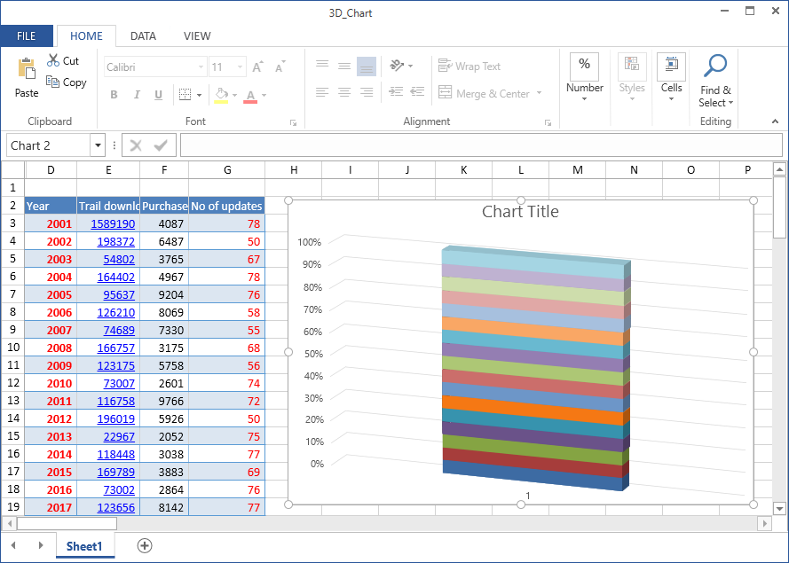

# How to Add 3D Charts in WPF Spreadsheet?

This example demonstrates how to add 3D charts in [WPF Spreadsheet](https://www.syncfusion.com/wpf-controls/spreadsheet) (SfSpreadsheet).

To enable the Spreadsheet for rendering 3D charts when importing Excel sheet, register [Graphic3DChartCellRenderer](https://help.syncfusion.com/cr/wpf/Syncfusion.UI.Xaml.SpreadsheetHelper.Graphic3DChartCellRenderer.html) by using [Add3DGraphicChartCellRenderer](https://help.syncfusion.com/cr/wpf/Syncfusion.UI.Xaml.Spreadsheet.GraphicCells.GraphicCellHelper.html#Syncfusion_UI_Xaml_Spreadsheet_GraphicCells_GraphicCellHelper_Add3DGraphicChartCellRenderer_Syncfusion_UI_Xaml_Spreadsheet_SfSpreadsheet_Syncfusion_UI_Xaml_Spreadsheet_GraphicCells_IGraphicCellRenderer_) method of spreadsheet.

``` csharp
//To render 3D charts in SfSpreadsheet control.
this.spreadsheetControl.Add3DGraphicChartCellRenderer(new Graphic3DChartCellRenderer());
```



Take a moment to peruse the [WPF Spreadsheet - Getting Started](https://help.syncfusion.com/wpf/classic/spreadsheet/getting-started) documentation, where you can find about spreadsheet with code examples.